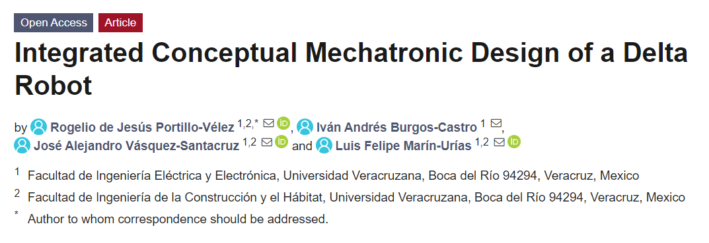

# delta-optimization

## This repo only uses matlab and numpy (not integrated with Cameo Systems Modeler)
NOTE: You should integrate numpy (python) with matlab to run the scripts (I will explain how to do it later cause I formatted my laptop)

This repo is the delta optimization only using matlab and numpy (not integrated with Cameo Systems Modeler, I will share those codes and guidelines to make them working together). The ga_delta_r1.m is the file you have to run to perform the simulation (ipk_delta_montecarlo.m and fun_objetivodelta.m must be in the same directory) the ga_delta_r1.m establishes the parameters for the genetic algorithm such as dimentional constraints, population and generation size, and maximizes the delta robot proposed-desired workspace defined by the montecarlo method in the fun_objetivodelta.m, this function calls to ipk_delta_montecarlo.m to check if the random points are within the delta robot workspace. For more details read my research paper available in: https://www.mdpi.com/2075-1702/10/3/186

